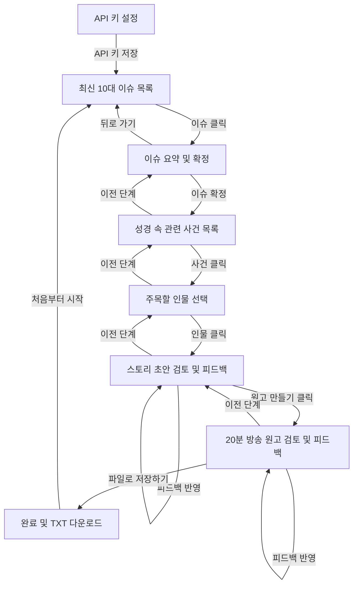

# 방송 원고 자동 생성기 설계 문서 (Design Specification)

이 문서는 사용자의 요청에 따라 최신 뉴스 이슈와 성경 속 사건/인물을 매핑하고, 은혜로운 방송 Q&A 대본(약 20분 분량)을 자동 생성하는 Electron + React 데스크톱 프로그램의 설계 사양을 정의합니다.

## 1. 아키텍처 및 기술 스택

- **프론트엔드**: React (TypeScript), Tailwind CSS v4, Lucide React (아이콘)
- **데스크톱 런타임**: Electron (Vite 번들링 및 Electron-Builder를 통한 포터블 `.exe` 빌드)
- **인공지능 SDK**: `@google/genai` (Google Gen AI 공식 SDK)
- **인공지능 모델**: 
  - `gemini-3.1-pro` (기본값, 풍성하고 논리적인 글쓰기와 대본 구성에 권장)
  - `gemini-3.5-flash` (빠른 연산 및 이슈 검색에 사용)
- **실시간 검색**: Google Search Grounding (`tools: [{ googleSearch: {} }]`)을 통해 실시간 뉴스 기사 및 트렌디한 이슈 10개 수집

---

## 2. 애플리케이션 상태 및 화면 흐름 (State Machine)

애플리케이션은 아래의 단계(`AppStep`)에 따라 제어됩니다:

### 각 단계별 상세 설명

1. **KEY_INPUT (API 키 설정)**
   - 최초 실행 시 `localStorage`에 저장된 `user_gemini_api_key`가 없는 경우 노출됩니다.
   - 키를 입력하면 안전하게 브라우저 로컬 저장소에 저장되어 매 세션마다 재입력할 필요가 없습니다.

2. **ISSUE_SELECTION (최신 10대 이슈 목록)**
   - `gemini-1.5-flash` 모델과 Google Search 도구를 사용하여 실시간으로 가장 뜨거운 최근 이슈 10개를 검색해 카드형 UI로 보여줍니다.

3. **ISSUE_DETAIL (이슈 요약 및 확정)**
   - 선택된 이슈의 배경 정보를 상세하게 출력합니다. 사용자는 이 이슈를 바탕으로 다음 단계로 넘어가거나(이슈 확정), 다른 이슈를 고르기 위해 이전 단계로 되돌아갈 수 있습니다.

4. **BIBLE_SELECTION (성경 속 관련 사건 목록)**
   - 확정된 최근 이슈와 연관 지어 깊은 신앙적 성찰과 교훈을 도출해낼 수 있는 성경 속 사건들(최소 4개 이상)을 매핑하여 보여줍니다.

5. **CHARACTER_SELECTION (주목할 인물 선택)**
   - 선택한 성경 사건 속에 등장하는 주요 인물들을 열거하고 간략한 소개를 보여줍니다. 사용자는 대본에서 집중 조명할 주인공(인물)을 선택합니다.

6. **ARTICLE_REVIEW (스토리 초안 검토 및 피드백)**
   - 선택한 인물을 중심으로 성경 이야기를 생생하게 풀어내고, 오늘날의 핫이슈와 연결해 우리가 배워야 할 성찰적 교훈을 담은 해설 글을 1차 생성합니다.
   - 사용자는 피드백을 적어 "본문에 피드백 반영하기"를 통해 마음에 들 때까지 글을 지속적으로 수정할 수 있습니다.

7. **SCRIPT_REVIEW (20분 방송 원고 검토 및 피드백)**
   - 완성된 해설 본문을 질문자(MC)와 답변자(전문가/게스트) 대화 형식의 방송 대본으로 변환합니다.
   - **질문자 역할**: 성경 내용을 알고 유도 질문을 던져 답변자가 은혜롭게 내용을 풀어내도록 서포트합니다.
   - **답변자 역할**: 인물과 사건의 비하인드 스토리, 이슈 해결의 실마리를 주도적으로 해설합니다.
   - 원고 역시 사용자의 추가적인 피드백을 반영해 실시간으로 다듬을 수 있습니다.

8. **COMPLETED (완료 및 TXT 다운로드)**
   - 대본 조율이 모두 끝나면 "파일로 저장하기"를 눌러 브라우저 다운로드 기능을 이용해 `[인물명]+[이슈명].txt` 포맷의 단일 텍스트 파일로 PC에 내장 저장합니다.

---

## 3. Gemini API 프롬프트 엔지니어링 설계

### A. 실시간 뉴스 기사 검색 및 10대 이슈 추출
- **API 설정**: `model: gemini-3.5-flash`, `responseMimeType: "application/json"`, `tools: [{ googleSearch: {} }]`
- **지침**: 최근 일주일간의 주요 기사를 검색하여 10개의 뜨거운 시사 이슈를 객관적인 배경과 함께 JSON 어레이 형태로 정리하도록 유도합니다.

### B. 사회 이슈와 성경 사건 매핑
- **API 설정**: `model: gemini-3.1-pro`, `responseMimeType: "application/json"`
- **지침**: 단순 키워드 매칭을 넘어, 사회적 갈등(예: 청년 실업, 기후 변화, 인간 소외 등)의 철학적·영적 본질이 성경 속 인물의 고뇌 및 하나님과의 동행 사건과 어떻게 교차하는지 심도 깊은 연관성(4개 이상)을 제시하도록 설계합니다.

### C. 질문자와 답변자 중심의 20분 대담 대본 구성
- **API 설정**: `model: gemini-3.1-pro`
- **지침**: 20분 분량에 걸맞은 대사 분량을 갖추기 위해, 성경 사건의 배경 상황 묘사, 대화의 긴장감, 청취자에게 던지는 메시지를 단계별로 풍부하게 서술하고 구어체(해요/죠/했습니다 등)와 오프닝/클로징 멘트를 명확히 구현합니다.

---

## 4. 자체 검증 및 셀프 리뷰 (Spec Self-Review)

- [x] **플레이스홀더 제거**: 모든 코드와 API 엔드포인트에 `TODO`나 하드코딩된 더미 토큰이 없으며, `localStorage` 기반 키 입력 방식을 온전히 사용합니다.
- [x] **일관성 검증**: 화면 전환(뒤로 가기/앞으로 가기) 시 이전 단계의 선택 상태가 유실되지 않도록 UI 컴포넌트 내부 State를 체계적으로 바인딩했습니다.
- [x] **파일 저장 규칙**: 사용자 요구사항에 부합하게 파일명이 `[인물명]+[이슈명].txt` 구조로 저장되도록 정규식을 통해 특수문자를 걸러내는 로직을 완비했습니다.
