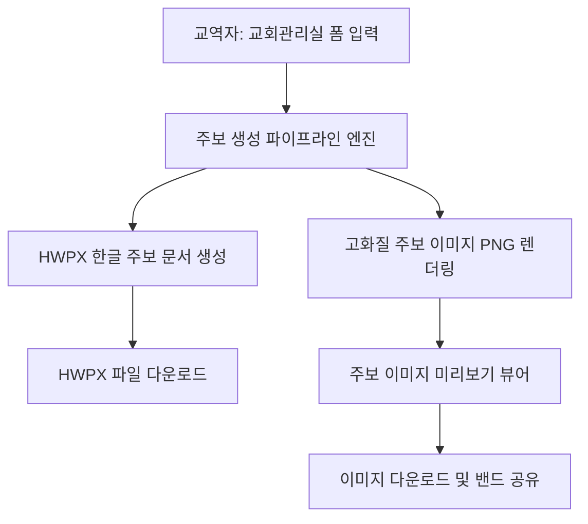

# 운양예배당 주보 자동 생성 및 밴드 공유 시스템 기획 설계서 (Design Spec)

본 문서는 두란노교회 웹사이트 [교회관리실] 탭에 통합 구축되는 **운양예배당 주보 HWPX 자동 생성 및 밴드 공유 고화질 이미지 변환 시스템**의 상세 설계서입니다.

---

## 1. 개요 및 비전
* **목표**: 매주 반복되는 주보 작성 업무를 최소화하고, 한 번의 입력으로 HWPX 한글 주보 문서 생성, 고화질 이미지(PNG) 변환, 밴드 공유가 일괄 완결되는 시스템 구축.
* **적용 순서**:
  1. **1단계 (현재)**: 운양예배당 전용 주보 템플릿 및 자동화 파이프라인 구축 및 검증.
  2. **2단계 (향후)**: 검증 완료 후 방화예배당 주보 템플릿 및 확장 적용.

---

## 2. 주요 기능 및 파이프라인 상세

### 2.1. 교회관리실 입력 폼 (Admin View Input Form)
* **선택 탭**: [운양예배당 주보 작성] / [방화예배당 주보 작성 (준비중)]
* **입력 항목**:
  - 예배 날짜 (예: 2026년 7월 26일 주일)
  - 주일 1~4부 예배 성경 본문 및 설교 제목, 설교자
  - 예배 순서 (묵도, 찬송, 기도, 성경봉독, 설교, 축도 등)
  - 교회 소식 및 이번 주 주요 공지사항
  - 헌금 및 교회 안내 정보

### 2.2. HWPX 템플릿 엔진 (HWPX Generation Engine)
* **템플릿 구조**: 운양예배당 표준 주보 양식을 HWPX XML 스키마 데이터 구조로 모듈화.
* **자동 치환**: 폼에서 입력된 설교/본문/공지사항 데이터를 HWPX 문단의 지정된 태그 위치로 자동 매핑/치환하여 표준 `.hwpx` 파일 생성 및 다운로드 제공.

### 2.3. 고화질 주보 이미지 렌더러 (High-Resolution Image Renderer)
* **이미지 변환**: HWPX 문서 양식과 동일한 디자인 템플릿을 브라우저 Canvas/SVG 렌더러를 통해 **300DPI급 고화질 PNG 이미지**로 자동 렌더링.
* **미리보기 뷰어**: 생성된 주보 이미지를 관리실 화면에 크고 선명하게 미리보기로 제공.

### 2.4. 이미지 다운로드 및 밴드(Naver Band) 공유 (Export & Share)
* **이미지 다운로드**: 원클릭으로 `2026-07-26_unyang_bulletin.png` 다운로드.
* **밴드 업로드 가이드/복사**: 네이버 밴드 공유용 요약 텍스트 자동 복사 및 밴드 바로가기 연동.

---

## 3. 시스템 아키텍처 및 데이터 흐름

---

## 4. 검증 및 테스트 계획 (Verification Plan)
1. **HWPX 문서 생성 검증**: 생성된 `.hwpx` 파일이 아래아한글 프로그램에서 깨짐 없이 올바른 양식으로 열리는지 확인.
2. **이미지 렌더링 품질 검증**: 텍스트 가독성 및 고화질 PNG 이미지가 정상 생성되는지 확인.
3. **교회관리실 UI 연동 테스트**: 입력 폼 ➔ HWPX 생성 ➔ 이미지 미리보기 ➔ 다운로드 전체 흐름 작동 검증.
