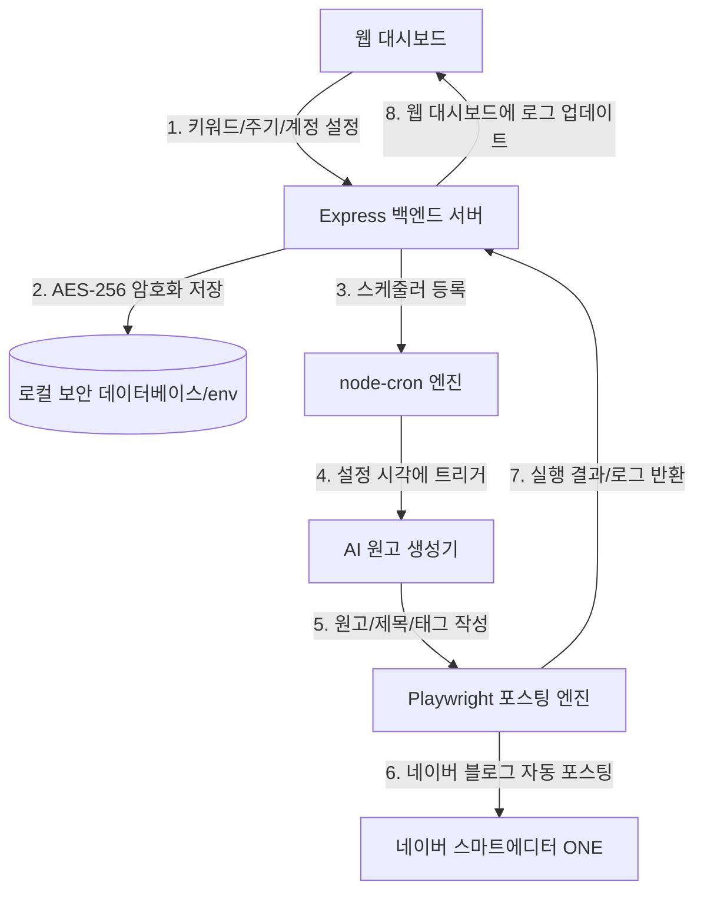

# [설계서] 네이버 블로그 작성 및 정기 자동 발행 시스템

## 1. 프로젝트 개요 (Overview)
- **프로젝트명**: 네이버 블로그 작성 자동화 (`naver-blog-automation`)
- **목적**: PC를 켜둔 상태에서 사용자가 설정한 키워드와 발행 주기에 맞춰 AI(OpenAI/Gemini)가 원고를 작성하고, Playwright 자동화 엔진이 네이버 블로그에 정기적으로 자동 포스팅을 수행하는 웹 대시보드 기반 서비스.

---

## 2. 주요 기능 (Features)
1. **웹 대시보드 (GUI)**:
   - 포스팅 키워드 및 AI 프롬프트 템플릿 관리
   - 네이버 계정(ID/PW) 및 AI API Key 안전한 입력/관리
   - 포스팅 정기 스케줄(예: 매일 오전 10시, 특정 요일 시각 등) 설정
   - 포스팅 성공/실패 내역 실시간 모니터링 및 로깅

2. **강력한 데이터 보안 (Security & Encryption)**:
   - 네이버 로그인 비밀번호 및 AI API Key 등 민감한 개인정보는 **AES-256-GCM** 암호화 로직을 적용하여 로컬 DB/파일에 안전하게 저장.

3. **AI 원고 자동 생성기 (AI Content Generator)**:
   - 선택한 AI 모델(OpenAI GPT-4o / Google Gemini)을 호출하여 네이버 블로그 스마트에디터 가이드라인에 맞춘 마크다운/HTML 원고, 제목, 관련 태그 자동 생성.

4. **네이버 블로그 포스팅 자동화 엔진 (Playwright Automation Engine)**:
   - Headless / Headful 브라우저 제어로 네이버 자동 로그인 (쿠키/세션 유지 지원)
   - 네이버 스마트에디터 ONE 접속 및 제목, 본문, 이미지(선택), 태그 입력 후 최종 발행 자동화.

5. **정기 실행 스케줄러 (Scheduler Engine)**:
   - `node-cron`을 활용하여 웹 대시보드에서 설정된 주기에 맞춰 백그라운드 자동 실행.

---

## 3. 기술 스택 (Tech Stack)
- **Language & Runtime**: Node.js (TypeScript / JavaScript ES Modules)
- **Web Framework**: Express.js (REST API 서버)
- **Frontend Dashboard**: HTML5, Vanilla CSS, JS (또는 Vite React) - 심플하고 깔끔한 모던 대시보드 UI
- **Automation Tool**: Playwright (`playwright` / `playwright-core`)
- **AI Integration**: OpenAI Node API (`openai`) / Google Generative AI API (`@google/genai`)
- **Scheduler**: `node-cron`
- **Security**: Node.js `crypto` 모듈 (AES-256-GCM 암호화/복호화)

---

## 4. 데이터 흐름 (Data Flow)

---

## 5. 단계별 개발 계획 (Step-by-Step Roadmap)
- **Step 1**: 프로젝트 초기화 (`package.json`, 디렉토리 구조, 암호화 모듈 구현)
- **Step 2**: AI 원고 생성 모듈 (`aiService.ts`) 구현 및 테스트
- **Step 3**: Playwright 네이버 블로그 자동 포스팅 모듈 (`naverService.ts`) 구현 및 로그인/발행 테스트
- **Step 4**: Express REST API & `node-cron` 스케줄러 백엔드 모듈 연동
- **Step 5**: 대시보드 웹 UI 구현 및 통합 테스트

---

## 6. 검토 및 승인 요청
위 설계서 내용과 보안/기술 스택 구성이 적절한지 검토해 주시기 바랍니다. 승인해 주시면 구현 계획(Implementation Plan) 수립 및 개발을 진행하겠습니다.
